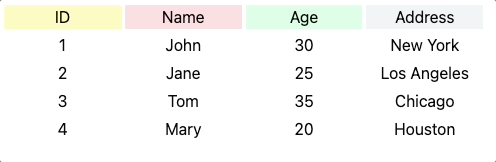

- [Introduction](#introduction)
  - [Components](#components)
  - [Techincal choice](#techincal-choice)
- [Installation](#installation)
- [Usage](#usage)
  - [Example 1](#example-1)
  - [Example 2](#example-2)
- [Run example](#run-example)
- [API](#api)
  - [Props](#props)
  - [HeaderConf](#headerconf)
  - [ClassNames](#classnames)
- [License](#license)

# Introduction

This is a component library that contains a table component that allows you to select columns from a table.

## Components

- ColumnSelectableTable


## Techincal choice

- React
- Typescript
- Shadcn/ui
- TailwindCSS
- Vite
- Vitest

# Installation

```bash
npm install column-selectable-table
```

# Usage

## Example 1

```jsx
import { ColumnSelectableTable } from 'zk-react-component-lib'

const data = [
    { id: '1', name: 'John', age: 30, address: 'New York' },
    { id: '2', name: 'Jane', age: 25, address: 'Los Angeles' },
    { id: '3', name: 'Tom', age: 35, address: 'Chicago' },
    { id: '4', name: 'Mary', age: 20, address: 'Houston' },
]

export const Example1 = () => {
    return (
        <ColumnSelectableTable
            dataSource={data}
            columnConfs={[
                { header: 'ID', field: 'id', headClassName: 'bg-yellow-100' },
                { header: 'Name', field: 'name', headClassName: 'bg-red-100' },
                { header: 'Age', field: 'age', headClassName: 'bg-green-100' },
                { header: 'Address', field: 'address', headClassName: 'bg-blue-100' },
            ]}
            allowSelect={true}
            className="grid grid-cols-3 gap-1"
            classNames={{
                headColumn: 'bg-gray-100',
                headRow: 'bg-gray-200',
                selected: 'bg-yellow-200',
            }}
        />
    );
}
```

The output and the effects when clicking on each column:



## Example 2

Added row configurations.

```jsx
import { ColumnSelectableTable } from 'zk-react-component-lib'

const data = [
    { id: '1', name: 'John', age: 30, address: 'New York' },
    { id: '2', name: 'Jane', age: 25, address: 'Los Angeles' },
    { id: '3', name: 'Tom', age: 35, address: 'Chicago' },
    { id: '4', name: 'Mary', age: 20, address: 'Houston' },
]

const columnConfs: { header: string; field: keyof typeof data[0] }[] = [
    { header: 'ID', field: 'id' },
    { header: 'Name', field: 'name' },
    { header: 'Age', field: 'age' },
    { header: 'Address', field: 'address' },
]

export const Example2 = () => {
    return (
        <ColumnSelectableTable
            dataSource={data}
            columnConfs={columnConfs}
            rowConfs={[
                { header: '第一行', headClassName: 'bg-yellow-100' },
                { header: '第二行', headClassName: 'bg-red-100' },
                { header: '第三行', headClassName: 'bg-green-100' },
                { header: '第四行', headClassName: 'bg-blue-200' },
            ]}
            allowSelect={true}
            className="grid grid-cols-3 gap-1"
            classNames={{
                headColumn: 'bg-gray-100',
                selected: 'bg-yellow-200',
            }}
        />
    );
}
```

The output and the effects when clicking on each column:


> NOTE: More advanced usage please consult the source code.

# Run example

```bash
cd examples/demo
pnpm install
pnpm run dev
```

# API


## Props

| Prop | Type | Default | Description |
| --- | --- | --- | --- |
| dataSource | any[] | undefined | The data source of the table |
| columnConfs | HeaderConf[] | undefined | The column configurations of the table |
| rowConfs | HeaderConf[] | undefined | The row configurations of the table |
| allowSelect | boolean | false | Whether to allow selecting columns |
| className | string | undefined | The class name of the table |
| classNames | ClassNames | undefined | The class names of the table |
| objectShowInColumn | boolean | false | Whether to show the object in the column |
| mergeSameValuesInRow | boolean | false | Whether to merge same values in the row |
| disallowHeadColumn | boolean | false | Whether to disallow head column |
| beforeRender | (data: T[]) => JSX.Element | undefined | The callback function before rendering the table |
| cellRender | (data: T, columnIndex: number, rowIndex: number, defaultRenderer: BaseDefaultRendererType&lt;T&gt;) => JSX.Element | undefined | The callback function for rendering cells |
| columnHeadRenderer | (data: T, columnIndex: number, rowIndex: number, defaultRenderer: BaseDefaultRendererType&lt;T&gt;) => JSX.Element | undefined | The callback function for rendering column headers |
| rowHeadRenderer | (data: T, columnIndex: number, rowIndex: number, defaultRenderer: BaseDefaultRendererType&lt;T&gt;) => JSX.Element | undefined | The callback function for rendering row headers |
| onSelect | (selectedColumns: HeaderConf[]) => void | undefined | The callback function when selecting columns |

## HeaderConf

| Prop | Type | Default | Description |
| --- | --- | --- | --- |
| header | string | undefined | The header of the column |
| field | string | undefined | The field of the column |
| className | string | undefined | The class name of the column |
| classNames | Object | undefined | The class names of headers and selected column |
| cellRender | (data: T, columnIndex: number, rowIndex: number, defaultRenderer: BaseDefaultRendererType&lt;T&gt;) => JSX.Element | undefined | The callback function for rendering cells |

## ClassNames

| Prop | Type | Default | Description |
| --- | --- | --- | --- |
| headColumn | string | undefined | The class name of the head column |
| headRow | string | undefined | The class name of the head row |
| selected | string | undefined | The class name of the selected column |  

# License

MIT
